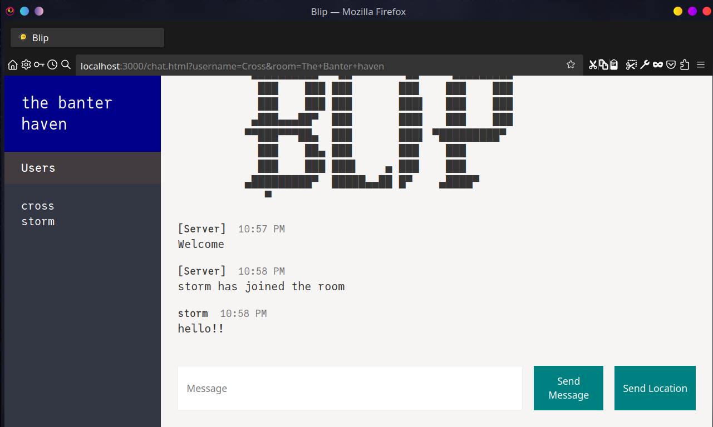

<div align="center">
<h1>📣 Blip</h1>

A web-based application to facilitate communication among users
in virtual rooms, similar to platforms like
[Discord](https://discord.com/) and
[Slack](https://slack.com/intl/en-in) built
using [Socket.IO](https://socket.io/)

Current version : 1.0



</div>

---

# Usage

After cloning the repository, run the following command in the same directory
that has the `package.json` file in it:

```zsh
npm install
```

To start the app, run:

```zsh
npm run start
```

and visit [`localhost:3000`](http://localhost:3000/)
(change the port to another number if
you include a `.env` file with a different `PORT`)

## Note

The only associated information with a user joined into a
particular room is their name, room-number, a unique `socket ID`
and their login time ; none of this information is stored on a database,
but rather in the host server's RAM (see `📁 src/utils/users.js`), so
any limitations on the number of users that can be simultaneously hosted
is entirely dependent on the server itself.

### Development

The project uses `nodemon` as a dev-dependency, so you can use the
script

```zsh
npm run dev
```

to enable live reloading of the server on changes to any `.js`, `.cjs`, `.mjs`
or `.html` files.

If you wish to include files of different extensions like `.ts` / `.tsx` or want
to use different template engines like `handlebars`, you can modify
the script within `package.json` as:

```json
"scripts": {
  "start": "node src/index.js",
  "dev": "nodemon src/index.js -e js, hbs, tsx",
  "test": "echo \"Error: no test specified\" && exit 1"
},
```

adding the necessary extensions after `-e` in `"dev"`

---
Project started on: 27/08/2023

(v1.0) First functional version completed on: 30/08/2023
